<p align="center">
  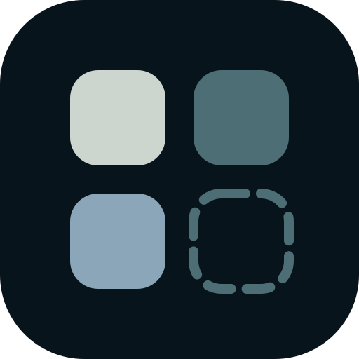
</p>

<h1 align="center">SkillVault</h1>

<p align="center">一个 Skill，只装一次；说需求，AI 帮你挑。</p>

<p align="center">
  本地优先、无需账号的 Agent Skill 管理工具。<br />
  扫描、整理、编辑和迁移本机 Skill，并按 Agent 独立控制启用状态。
</p>

<p align="center">
  
  
  
  
  
</p>

<p align="center">
  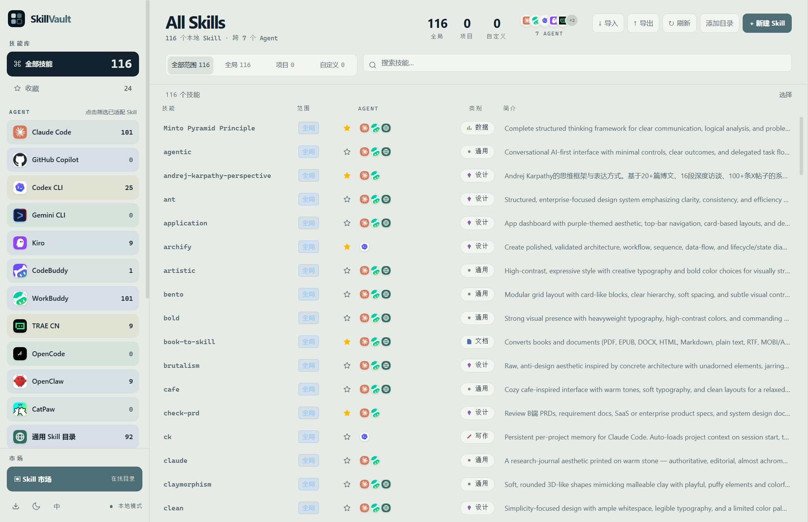
</p>

## 为什么需要 SkillVault

同一个 Skill 往往需要分别复制到 Claude Code、Codex CLI、Cursor 等多个 Agent 目录。设备一多、Skill 一多，很快就会出现重复文件、版本不一致和迁移困难。

SkillVault 将本地 Skill 作为母本统一管理：一个 Skill 只保留一份，再按需适配到不同 Agent。所有扫描、编辑、收藏、集合和迁移操作都在本地完成，不依赖用户系统。

## 主要功能

- **统一管理本地 Skill**：扫描全局目录、项目目录和自定义目录，集中查看与编辑 `SKILL.md`
- **按 Agent 独立启用**：同一个 Skill 可一键适配到多个 Agent，开关点击后立即生效
- **批量整理**：支持多选、收藏、集合，以及批量适配到指定 Agent
- **迁移包导入导出**：按全局、项目或选中范围打包，保留原有 Agent 启用关系
- **导入预处理**：导入前识别缺失或尚未适配的 Agent，避免直接写入无效目录
- **90,000+ Skill 市场**：沿用现有市场数据与安装逻辑，支持搜索、分页、收藏和指定 Agent 安装
- **AI 意图匹配市场**：用一句话描述需求，本地语义模型自动从仓库匹配最相关的技能，并给出「是什么 / 有什么用 / 怎么用」介绍与一键安装
- **离线可用**：已安装 Skill、中文描述和本地管理功能无需联网

<p align="center">
  
</p>

<p align="center">
  
</p>

<p align="center">
  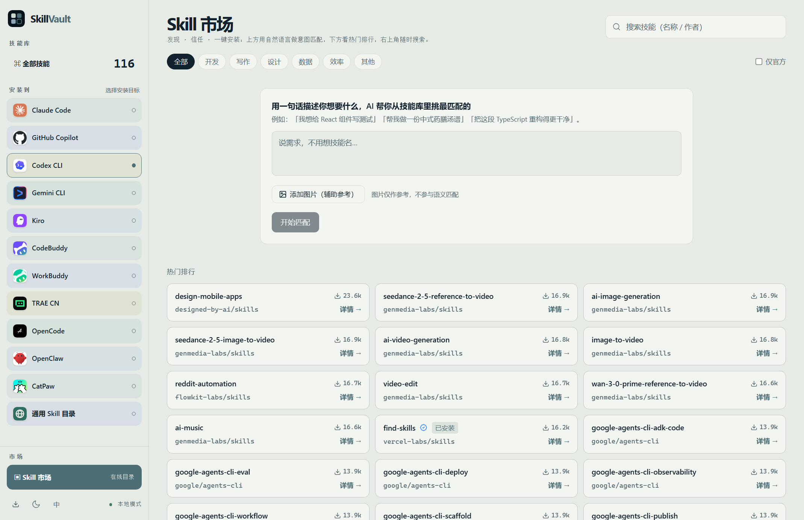
</p>

## AI 意图匹配市场

除了按名称 / 作者搜索，你也可以用**自然语言**描述需求，由本地语义模型自动从仓库中挑出最相关的技能。

- 打开「发现」页的 **意图匹配** Tab；
- 用一句话描述你想做的事（例如「帮我写单元测试」「把这段 SQL 优化一下」「生成一个 React 组件」）；
- 系统返回 Top-K 匹配技能，每张卡片给出「是什么 / 有什么用 / 怎么用」三段介绍与**一键安装**；
- 模型在本地运行（基于 `Xenova/all-MiniLM-L6-v2`），首次使用会自动下载；无网络或模型不可用时自动降级为关键词匹配，功能不中断。

数据源沿用 [skills.sh](https://www.skills.sh/) 的 `owner/repo` 模型，安装通过 `npx skills add <owner/repo>` 完成。

<p align="center">
  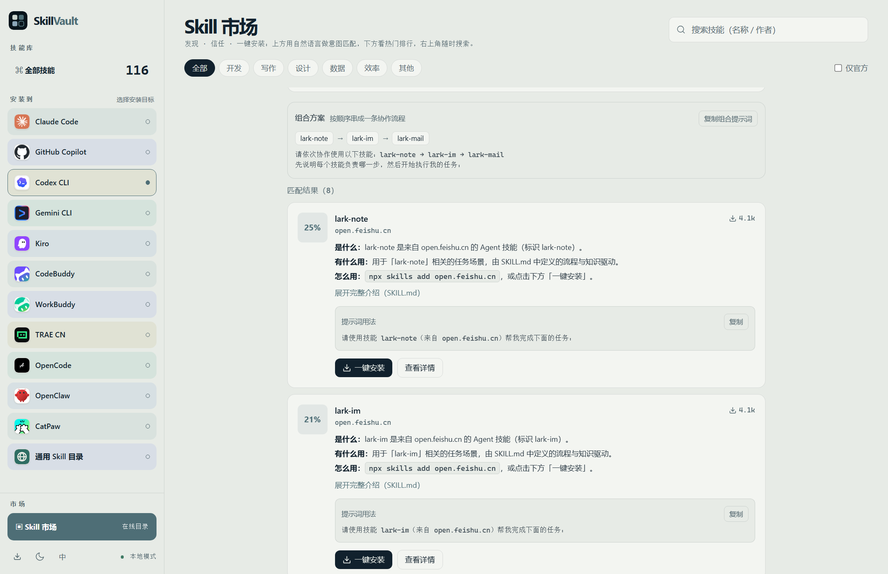
</p>

## 支持的 Agent

当前内置 42 个 Agent 适配目标。SkillVault 只显示本机实际检测到的 Agent，并使用项目内置的品牌彩色图标。

<table>
  <tr>
    <td align="center" width="25%">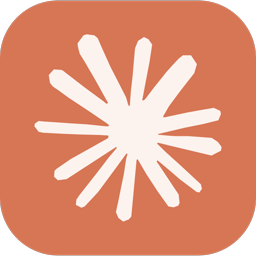<br /><b>Claude Code</b><br /><code>claude-code</code></td>
    <td align="center" width="25%">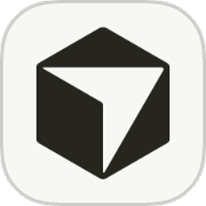<br /><b>Cursor</b><br /><code>cursor</code></td>
    <td align="center" width="25%"><br /><b>GitHub Copilot</b><br /><code>github-copilot</code></td>
    <td align="center" width="25%">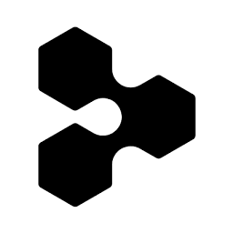<br /><b>Windsurf</b><br /><code>windsurf</code></td>
  </tr>
  <tr>
    <td align="center">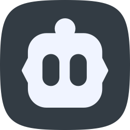<br /><b>Cline</b><br /><code>cline</code></td>
    <td align="center">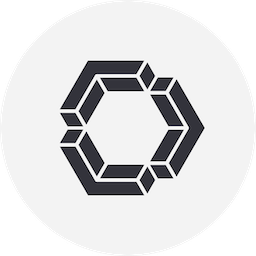<br /><b>Continue</b><br /><code>continue</code></td>
    <td align="center">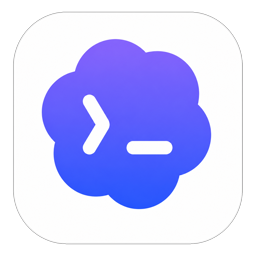<br /><b>Codex CLI</b><br /><code>codex-cli</code></td>
    <td align="center"><br /><b>WorkBuddy</b><br /><code>workbuddy</code></td>
  </tr>
  <tr>
    <td align="center">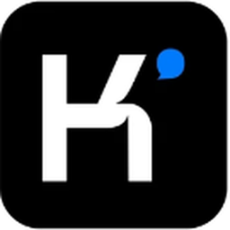<br /><b>Kimi Code</b><br /><code>kimi-code</code></td>
    <td align="center">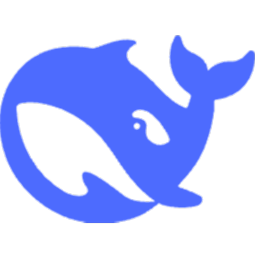<br /><b>DeepSeek Harness</b><br /><code>deepseek-harness</code></td>
    <td align="center"><br /><b>QoderWork</b><br /><code>qoderwork</code></td>
    <td align="center">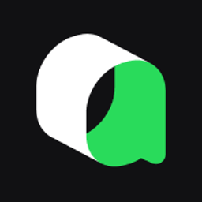<br /><b>Qoder CLI</b><br /><code>qoder</code></td>
  </tr>
  <tr>
    <td align="center"><br /><b>TRAE</b><br /><code>trae</code></td>
    <td align="center"><br /><b>Droid CLI</b><br /><code>droid-cli</code></td>
    <td align="center"><br /><b>OB-1</b><br /><code>ob-1</code></td>
    <td align="center"><br /><b>Amp</b><br /><code>amp</code></td>
  </tr>
  <tr>
    <td align="center">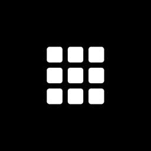<br /><b>Goose</b><br /><code>goose</code></td>
    <td align="center">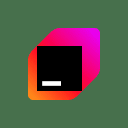<br /><b>Junie</b><br /><code>junie</code></td>
    <td align="center">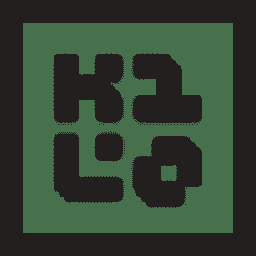<br /><b>Kilo Code</b><br /><code>kilo-code</code></td>
    <td align="center">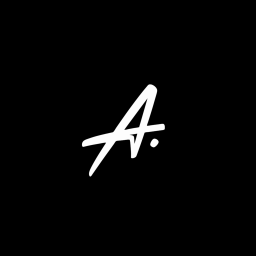<br /><b>OpenCode</b><br /><code>opencode</code></td>
  </tr>
  <tr>
    <td align="center">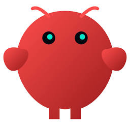<br /><b>OpenClaw</b><br /><code>openclaw</code></td>
    <td align="center"><br /><b>Pear AI</b><br /><code>pear-ai</code></td>
    <td align="center">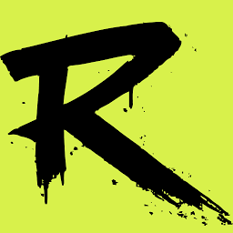<br /><b>Roo Code</b><br /><code>roo-code</code></td>
    <td align="center">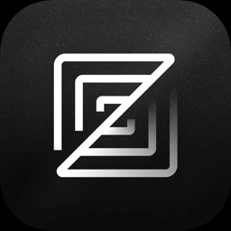<br /><b>Zed</b><br /><code>zed</code></td>
  </tr>
  <tr>
    <td align="center"><br /><b>ZCode</b><br /><code>zcode</code></td>
    <td align="center"><br /><b>Gemini CLI</b><br /><code>gemini-cli</code></td>
    <td align="center"><br /><b>Qwen Code</b><br /><code>qwen-code</code></td>
    <td align="center"><br /><b>Kiro</b><br /><code>kiro</code></td>
  </tr>
  <tr>
    <td align="center"><br /><b>Pi</b><br /><code>pi</code></td>
    <td align="center"><br /><b>CodeBuddy</b><br /><code>codebuddy</code></td>
    <td align="center"><br /><b>MiniMax Code</b><br /><code>minimax-code</code></td>
    <td align="center"><br /><b>Comate</b><br /><code>comate</code></td>
  </tr>
  <tr>
    <td align="center"><br /><b>Lingma</b><br /><code>lingma</code></td>
    <td align="center"><br /><b>CodeArts</b><br /><code>codearts</code></td>
    <td align="center"><br /><b>Hermes</b><br /><code>hermes-agent</code></td>
    <td align="center">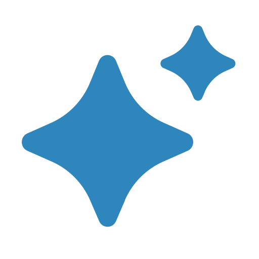<br /><b>AstrBot</b><br /><code>astrbot</code></td>
  </tr>
  <tr>
    <td align="center"><br /><b>Qoder CN</b><br /><code>qoder-cn</code></td>
    <td align="center"><br /><b>TRAE CN</b><br /><code>trae-cn</code></td>
    <td align="center"><br /><b>TraeCode CLI</b><br /><code>traecode-cli</code></td>
    <td></td>
  </tr>
  <tr>
    <td align="center"><br /><b>MiMo Code</b><br /><code>mimo-code</code></td>
    <td align="center"><br /><b>iFlow CLI</b><br /><code>iflow-cli</code></td>
    <td align="center">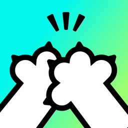<br /><b>CatPaw</b><br /><code>catpaw</code></td>
    <td></td>
  </tr>
</table>

此外，SkillVault 支持将 `~/.agents/skills` 作为跨 Agent 共用的 **通用 Skill 目录**。

## 更新日志

### v1.0.2

- 修复「发现」页 SKILL 市场点击后空白的问题（`viewMode` 状态未声明导致渲染即崩溃）
- 还原品牌 LOGO 与 v0.1.0 莫兰迪配色规范（`--accent:#4E6E76`、`--background:#E7EBE6`），移除开发期暖橙配色

### v1.0.1

- 修复「意图匹配」Tab 崩溃（`intentCorpus` / `intentAgents` 未定义）
- 修正更新说明指向的错误仓库，并统一用户界面 SkillVault 品牌文案与图标

## 下载安装

前往 [Releases](../../releases/latest) 下载对应平台的安装包：

- Windows：NSIS 安装包
- macOS：Apple 芯片与 Intel 芯片分别构建
- Linux：AppImage 与 Debian 安装包

也可以通过 npm 自动识别平台、下载并打开对应安装包：

```bash
npx skillvault-app
```

### macOS 首次安装

当前 macOS 安装包尚未完成 Apple 开发者签名和公证。若首次打开时提示“SkillVault 已损坏，无法打开”，请确认安装包来自本仓库的 [Releases](../../releases/latest)，然后：

1. 将 `SkillVault.app` 拖入“应用程序”文件夹。
2. 打开“终端”，执行：

```bash
xattr -dr com.apple.quarantine "/Applications/SkillVault.app"
```

3. 前往“应用程序”，右键点击 SkillVault，选择“打开”。

如果系统提示无法验证开发者，也可以前往“系统设置 → 隐私与安全”，点击“仍要打开”，具体可参考 [Apple 官方说明](https://support.apple.com/102445)。该安装包未经 Apple 签名与公证，请勿对非官方来源的文件执行上述命令。完成正式签名后将不再需要此操作。

## 本地开发

环境要求：Node.js 18+。

```bash
npm install
npm run dev --workspace=@skillvault/desktop
```

构建桌面端：

```bash
npm run build --workspace=@skillvault/desktop
```

项目使用 npm workspaces。桌面端位于 `apps/desktop`，Skill 安装与发现逻辑位于 `packages/cli`。

完整的桌面端发布流程见 [docs/desktop-release.md](docs/desktop-release.md)。

## 开源协议

[MIT](LICENSE)
